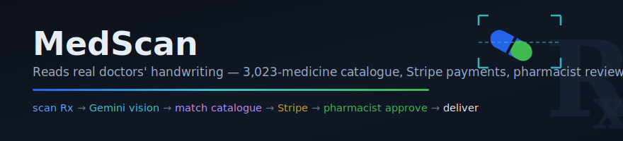
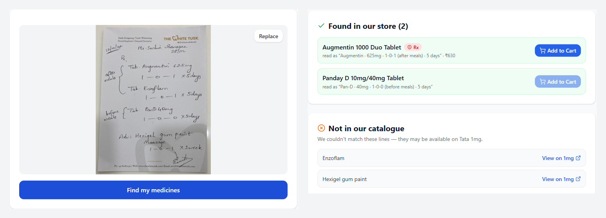
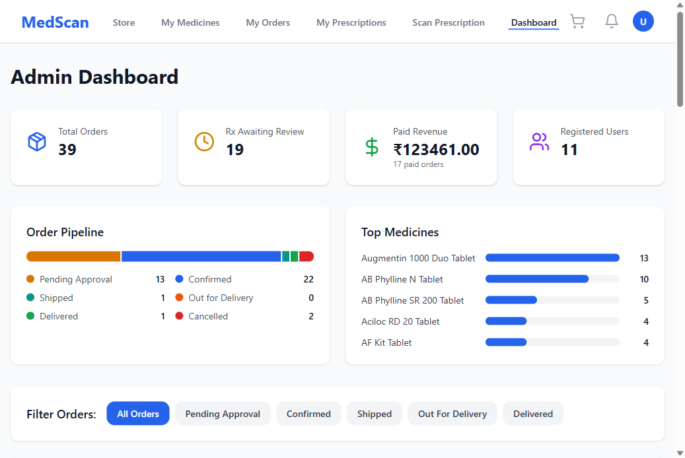
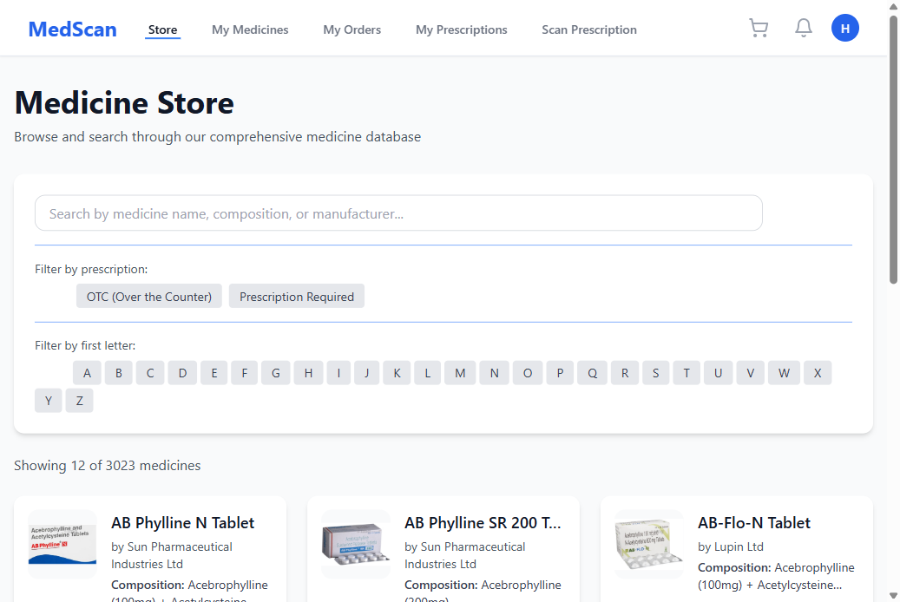
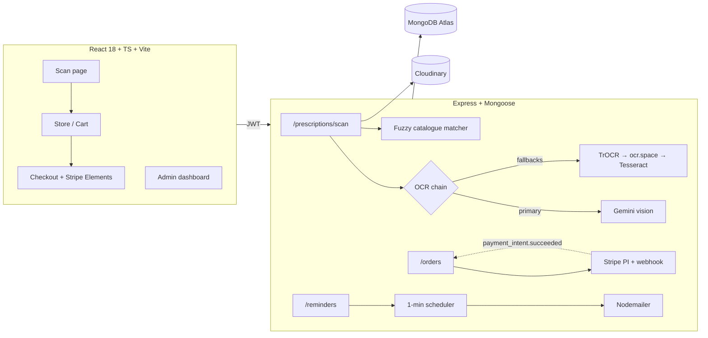

<div align="center">



**Photograph a doctor's handwritten prescription and check out with the right medicines in under a minute — vision-LLM OCR, a 3,023-medicine catalogue, Stripe payments, and a pharmacist approval queue, verified end-to-end against a real dental prescription.**


[Live app](https://med-scan-rosy.vercel.app) · [API](https://medscan-backend-77bx.onrender.com/api/health)

</div>

## What it does

MedScan is a full e-pharmacy: a patient photographs a prescription, a vision LLM reads the
handwriting and returns each medicine with its dosage and schedule, matched items go straight
into a cart backed by a 3,023-medicine catalogue scraped from 1mg, payment runs through Stripe,
and prescription-required orders are held for a pharmacist who reviews the original image
before approving. Reminders then nag the patient by email and in-app notification at the times
they picked.

This is the app reading an actual handwritten dental prescription — schedule-level accuracy
("Pan-D · 40mg · 1-0-0 (before meals) · 5 days" recovered from cursive):

<p align="center"></p>

The clever part is the OCR strategy. Character-level OCR engines can't read doctors'
handwriting, so the scan endpoint sends the image to **Gemini vision with a structured-JSON
prompt** — the model corrects misreads to real Indian brand names ("Angmentin" → Augmentin)
and returns `{name, dosage, frequency, duration}` per medicine. The chain degrades gracefully:
Gemini (with 429/503 retry) → TrOCR → ocr.space → on-device Tesseract, and a fuzzy matcher
(dose-form stripping, hyphen collapsing, single-character wildcard regex) rescues whatever the
weaker engines misread.

## Verified end-to-end

Real captured run of [`mongodb_backend/scripts/e2e-demo.mjs`](mongodb_backend/scripts/e2e-demo.mjs)
against the handwritten prescription above — scan to paid order, including a signature-verified
Stripe webhook:

<p align="center"></p>

All four medicines on the page were extracted; the two "not in catalogue" lines are correct —
those products genuinely aren't in the store, so the UI offers a Tata 1mg search link instead.
Scans typically take 10–25 s (measured), occasionally longer under Gemini free-tier load — the
built-in retry absorbs transient 503s.

## By the numbers (measured)

| Metric | Value |
|---|---|
| Catalogue size | 3,023 medicines scraped from 1mg (name, composition, price, Rx flag, images) |
| Handwritten test Rx | 4/4 medicines extracted with dosage + schedule; 2/2 catalogue items matched |
| E2E pipeline | 8/8 steps pass, scan → paid order, webhook signature-verified |
| Production webhook | Delivered by Stripe to the Render deployment and processed (order marked paid) |
| OCR chain depth | 4 engines with graceful degradation |

## Highlights

- **Vision-LLM OCR with structured extraction** — not a text dump: each medicine arrives as
  `{name, dosage, frequency, duration}`, with handwriting misreads corrected by the model itself.
- **Hand-built fuzzy medicine matcher** — dose-form prefix stripping (`Tab.`/`Cap.`/`Inj.`),
  brace-grouped meal-instruction splitting, hyphen collapsing ("Pan-D" → "Panday D"), and
  single-substitution wildcard regexes so one misread character still finds the right product.
- **Real payment lifecycle** — card-only payment intents (`allow_redirects: 'never'`), raw-body
  webhook mounted before the JSON parser for signature verification, idempotent order updates
  keyed on `metadata.orderId`.
- **Pharmacist compliance loop** — Rx orders enter `pending_approval`; admins see the original
  prescription image and approve/reject; the decision syncs the prescription record and
  notifies the patient in-app + by email.
- **OTP-verified signup** — 6-digit emailed code, 15-minute expiry, account rolled back if the
  email can't be sent, unverified logins re-issue a fresh code.
- **Medicine reminders** — morning/afternoon/night presets or custom times, a 1-minute
  scheduler tick, delivered as in-app notifications and templated emails.
- **Admin analytics** — MongoDB aggregation endpoint (orders by status, paid revenue, top
  medicines) feeding a dashboard with a colorblind-validated status palette.

<p align="center">


</p>

## Architecture



Prescription images live on Cloudinary (`prescriptions/`, `profile-photos/`); the document in
Mongo stores the extracted text, engine used, matches, and review status, and is linked to the
order so the pharmacist sees exactly what the patient uploaded.

## Quick start

```bash
# backend
cd mongodb_backend
cp .env.example .env        # fill in Mongo, Stripe test keys, Gemini, Cloudinary, SMTP
npm install && npm start    # http://localhost:5001/api/health

# frontend (separate terminal)
cd PrescriptionManagement
cp .env.example .env
npm install && npm run dev  # http://localhost:3000
```

Try it: sign up (a real verification code is emailed), scan a prescription photo, add matches
to the cart, and pay with Stripe's test card `4242 4242 4242 4242`. The full pipeline check is
`node scripts/e2e-demo.mjs <prescription-image>` from `mongodb_backend/`.

## API surface

| Route | What it does |
|---|---|
| `POST /api/prescriptions/scan` | image → OCR chain → structured medicines → catalogue matches |
| `POST /api/auth/register` → `POST /api/auth/verify-email` | OTP signup handshake |
| `POST /api/orders/create` | cart → order, attaches prescription, doctor name + license |
| `POST /api/orders/stripe/create-payment-intent` | card-only PI with `orderId` metadata |
| `POST /api/orders/stripe/webhook` | signature-verified, marks orders paid/failed |
| `GET /api/orders/admin/stats` | aggregation: pipeline counts, revenue, top medicines |
| `POST /api/reminders` | per-medicine schedules (presets + custom `HH:MM`) |

## Project layout

```
mongodb_backend/          Express API
  src/services/ocrService.js       Gemini vision + 3-stage fallback chain
  src/routes/prescriptions.js      scan endpoint + fuzzy catalogue matcher
  src/routes/stripeWebhook.js      raw-body signature verification
  src/services/reminderScheduler.js
  scripts/e2e-demo.mjs             the verified scan→paid-order pipeline
PrescriptionManagement/   React 18 + TypeScript client (Vite, Tailwind, React Query)
  client/src/pages/scan-prescription.tsx
  client/src/pages/AdminDashboardPage.tsx
scraping_backend/         Puppeteer scraper that built the 3,023-medicine catalogue
```

## Technical notes

<details>
<summary><b>Why an LLM instead of OCR — and what the fallback chain buys</b></summary>

TrOCR and ocr.space read the printed letterhead fine but produced "Angmentin", "ParD 40ng",
"Enzoflamn" from the handwriting. Gemini reads the same image contextually — it knows "Tab.
Angmentin 625mg" must be Augmentin — and the structured-JSON prompt (`response_mime_type:
application/json`, temperature 0) makes the output machine-usable, not just human-readable.
Every engine below Gemini stays wired in: a scan never hard-fails because one vendor is down,
and the response records which engine produced it (`ocrEngine`), which the UI surfaces as an
"AI Vision" badge.
</details>

<details>
<summary><b>The fuzzy matcher that rescues weaker engines</b></summary>

When a scan does degrade to character-level OCR, `matchAgainstCatalogue` still recovers most
medicines: it strips dose-form prefixes, splits brace-grouped meal instructions, ignores
contact/header lines, then tries (1) exact brand-word prefix, (2) hyphen-collapsed prefix,
(3) first-6-letters prefix, (4) a `$or` of single-character wildcard regexes — so exactly one
misread letter anywhere in the word still matches. Four-letter fragments only get fuzzed when
the line carries a dose (`40mg`), which killed the false positives ("avee" no longer matches
Avencobal) without losing real drugs.
</details>

<details>
<summary><b>Stripe integration details that usually bite people</b></summary>

The webhook route is mounted with `express.raw()` <em>before</em> the global JSON parser —
signature verification needs the untouched body bytes. Payment intents are created with
`automatic_payment_methods: {enabled, allow_redirects: 'never'}` because the client uses
card-only `confirmCardPayment`; without that, Stripe demands a `return_url` and confirms fail
(found via Stripe's own integration-failure email, reproduced, fixed, and re-verified against
the deployed backend with a real Stripe-delivered event).
</details>

<details>
<summary><b>Email as a first-class channel</b></summary>

One nodemailer transport backs four flows: OTP verification (with account rollback if the send
fails — no stranded half-accounts), password reset, order-status updates mirrored from every
in-app notification, and scheduled medicine reminders. All sends are fire-and-forget wrappers
that no-op without SMTP creds, so email being down never breaks an API request.
</details>

Natural extensions: catalogue category/price filters, an order-tracking timeline, moving the
reminder scheduler to a job queue for multi-instance deployments.

Built to prove one thing: a single developer can ship a regulated-commerce flow — AI intake,
payments, human review, and lifecycle notifications — that survives real handwriting and real
webhooks.
